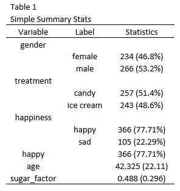

layout: true
background-color: #fafaef
<div class="my-footer"></div>


```{r setup, include=FALSE}
library(knitr)
library(tidyverse)
library(methodsR)
options(knitr.table.format = "html")
```

---

# Install Package

```{r, eval = FALSE}

creds <- git2r::cred_ssh_key("~/../.ssh/id_rsa.pub",
                             "~/../.ssh/id_rsa")

devtools::install_git("git@gitlab.com:methodsconsultants/r-package/methods-r-package.git",
                      credentials = creds,
                      upgrade_dependencies = FALSE)

```

---

# Read in Example Data

```{r}

file <- system.file("extdata", "example-treatment-data.csv", package = "methodsR")

dat  <- read.csv(file) %>%
  as_data_frame()

dat %>%
  tail() %>%
  kable()

```

---

# Goal



---


---

# Continuous Variables Summary
## Simple Univariate Tables

Simple summary statistics for continuous variables is easy, so lets start here. `age` and `sugar_factor` are the continuous variables.

```{r}

cont_variables <- c("age", "sugar_factor")

mean_na <- partial(mean, na.rm = TRUE)
sd_na <- partial(sd, na.rm = TRUE)

dat %>%
  select(cont_variables) %>%
  summarise_all(funs("Mean" = mean_na, "SD" = sd_na)) %>%
  kable()

```

---

## Simple Univariate Tables

```{r}

dat %>%
  select(cont_variables) %>%
  summarise_all(funs("Mean" = mean_na, "SD" = sd_na)) %>%
  gather(var, val) %>%
  separate(var, c("var", "mean_sd"), "_(?!.*_)") %>%
  spread(key = mean_sd, value = val) %>%
  kable()

```

---

## Simple Univariate Tables

```{r}

dat %>%
  select(cont_variables) %>%
  summarise_all(funs("Mean" = mean_na, "SD" = sd_na)) %>%
  gather(Variable, val) %>%
  separate(Variable, c("Variable", "mean_sd"), "_(?!.*_)") %>%
  spread(key = mean_sd, value = val) %>%
  mutate(`Mean (SD)` = paste0(round(Mean, 3), " (", round(SD, 3), ")")) %>%
  select(-Mean, -SD) %>%
  kable()

```

---

## Simple Univariate Tables

This is almost exactly what `mean_sd_cont` does when a treatment variable is not provided. 

```{r}

dat %>%
  mean_sd_cont(cont_variables = c("age", "sugar_factor")) %>%
  kable()

```

---

## Simple Univariate Tables

Also if variables are not provided, it will infer the variables from column types. 

```{r}

dat %>%
  mean_sd_cont() %>%
  kable()

```

---

## Split by Treatment

Presenting a table of summary statistics split by a treatment variable, along with p-values is a common task. 

```{r}

summary_tab <- dat %>%
  select(cont_variables, treatment) %>%
  group_by(treatment) %>%
  summarise_all(funs("Mean" = mean_na, "SD" = sd_na)) %>%
  gather(Variable, val, -treatment) %>%
  separate(Variable, c("Variable", "mean_sd"), "_(?!.*_)") %>%
  spread(key = mean_sd, value = val) %>%
  mutate(`Mean (SD)` = paste0(round(Mean, 3), " (", round(SD, 3), ")")) %>%
  select(-Mean, -SD) %>%
  spread(treatment, `Mean (SD)`)

summary_tab %>%
  kable()

```

---

## Split by Treatment

```{r}

t_test_p(df = dat, var = "age", treatment = "treatment")

summary_tab %>%
  mutate(`P Value` = purrr::map_dbl(Variable, partial(t_test_p, df = dat, treatment = "treatment"))) %>%
  kable()

```

---

## Split by Treatment

`mean_sd_cont` will produce a treatment-split table if a treatment column is specified.

```{r}

dat %>%
  mean_sd_cont(treatment = "treatment", cont_variables = c("age", "sugar_factor")) %>%
  kable()

```

---

## Split by Treatment

```{r}

dat %>%
  mean_sd_cont(treatment = "treatment") %>%
  kable()

```

---

## Split by Treatment

By default it will round p-values, you can get the raw p-value by setting `round_p = FALSE`.

```{r}

dat %>%
  mean_sd_cont(treatment = "treatment", round_p = FALSE) %>%
  kable()

```

---

# Categorical Variable Summary

## Univariate Summary Table

```{r}

cat_variables <- c("gender", "happiness", "happy")

dat <- dat %>%
  mutate_if(is.factor, as.character)

```

```{r}

dat %>%
  count(gender) %>%
  kable()

```

---

## Univariate Summary Table

```{r}

dat %>%
  count(gender) %>%
  mutate(`N (%)` = methodsR:::proportions(n)) %>%
  select(-n) %>%
  kable()

```

---

## Univariate Summary Table

```{r}

dat %>%
  count(gender) %>%
  mutate(`N (%)` = methodsR:::proportions(n)) %>%
  select(-n) %>%
  methodsR:::add_spacing(is_treatment = FALSE) %>%
  kable()

```

---

## Univariate Summary Table

```{r}

simple_one_variable <- function(df, var) {
  
  var <- sym(var)
  
  df %>%
    count(!!var) %>%
    filter(!is.na(!!var)) %>%
    mutate(`N (%)` = methodsR:::proportions(n)) %>%
    select(-n) %>%
    methodsR:::add_spacing(is_treatment = FALSE)
  
}

```

---

## Univariate Summary Table

```{r}
cat_variables %>%
  map_dfr(partial(simple_one_variable, df = dat)) %>%
  kable()

```

---

## Univariate Summary Table

`cat_summary` provides this functionality, along with additional features such as convering yes/no and 0/1 variables to binary.

```{r}

dat %>%
  cat_summary(cat_variables = c("gender", "happiness", "happy")) %>%
  kable()

```

---

## Univariate Summary Table

```{r}

dat %>%
  cat_summary() %>%
  kable()

```

---

## Summary Table Split by Treatment

```{r}

dat %>%
  select(gender, treatment) %>%
  group_by(treatment) %>%
  count(gender) %>%
  spread(treatment, n) %>%
  mutate_at(vars(-gender), funs(methodsR:::proportions)) %>%
  kable()

```

---

## Summary Table Split by Treatment

```{r}

p_val <- dat %>%
  chi_fisher_p("gender", "treatment") %>%
  round(3)

dat %>%
  select(gender, treatment) %>%
  group_by(treatment) %>%
  count(gender) %>%
  spread(treatment, n) %>%
  mutate_at(vars(-gender), funs(methodsR:::proportions)) %>%
  methodsR:::add_spacing(is_treatment = TRUE, p_value = p_val) %>%
  kable()

```

---

## Summary Table Split by Treatment

Make function, and iterate.

```{r}

treat_one_variable <- function(df, var, treatment) {
  
  var <- sym(var)
  treatment <- sym(treatment)
  
  treat_messy <- df %>%
    select(!!treatment, !!var) %>%
    group_by(!!treatment) %>%
    count(!!var) %>%                              # Add counts
    spread(!!treatment, n) %>%                    # Reshape
    filter(!is.na(!!var)) %>%
    mutate_at(vars(-UQ(var)), funs(methodsR:::proportions))  # Add proportions

  p_val <- df %>%
    chi_fisher_p(quo_name(var), quo_name(treatment)) %>%
    round(3)

  treat_messy %>%
    methodsR:::add_spacing(is_treatment = TRUE, p_value = p_val)

}

```

---

## Summary Table Split by Treatment

```{r}

cat_variables %>%
  purrr::map_dfr(purrr::partial(treat_one_variable, df = dat, treatment = "treatment")) %>%
  kable()

```

---

## Summary Table Split by Treatment

```{r}

dat %>%
  cat_summary("treatment", c("gender", "happiness", "happy")) %>%
  kable()

```

---

## Summary Table Split by Treatment

```{r}

dat %>%
  cat_summary("treatment") %>%
  kable()

```

---

# Combined Continuous and Categorical Table

```{r}

dat %>%
  all_summary("treatment") %>%
  kable()

```

---

```{r}

dat %>%
  all_summary() %>%
  kable()

```